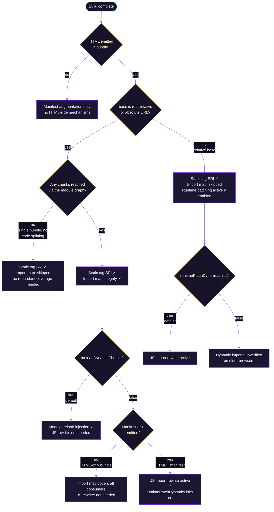

# Coverage Strategies

A Vite app loads code through several different mechanisms, and SRI enforcement must be wired up separately for each one. The plugin provides multiple strategies that layer on top of each other, with sensible defaults covering the common case and opt-in controls for the rest.

## Static Tags

The most direct case: `<script src="...">`, `<link rel="stylesheet" href="...">`, and `<link rel="modulepreload" href="...">` tags already present in your HTML are found at build time and have `integrity` (and `crossorigin`, if configured) added directly.

This covers every asset that Vite injects into your HTML during the build — your entry chunk, any eagerly-imported CSS, and any modulepreload links Vite itself emits. It also covers any remote CDN resources you've referenced manually.

## Import Map Integrity

Whenever the build emits HTML **and** `base` is root-relative (`/`) or an absolute URL, the plugin injects a `<script type="importmap">` into each HTML file, listing the chunks reached through the module graph (via another chunk's static `import` or dynamic `import()`):

```html
<script type="importmap">
{"integrity":{"/assets/index-B3sb0LQp.js":"sha384-…","/assets/chunk-Cab12xJ4.js":"sha384-…"}}
</script>
```

A chunk that's only ever loaded via a rendered top-level `<script>`/`<link>` tag is left out — that tag's own `integrity` attribute already covers it. A build with a single JS bundle and no code splitting therefore emits no import map at all: its one entry chunk is fully covered by its `<script integrity>` tag.

Browsers that support import map integrity (Chrome 127+, Firefox 138+, Safari 18+) apply the declared hashes to **every matching module fetch** — static `import` statements, dynamic `import()` calls, and module preloads alike. A module whose bytes don't match the declared hash is refused before execution.

Notably, this catches statically imported chunks that `modulepreload` discovery misses — for example, facade re-export modules that are statically imported but not directly referenced as dynamic imports.

Older browsers parse the map but ignore the `integrity` key; module loads proceed normally, the same progressive-enhancement model as SRI attributes in general.

If your HTML already includes a `<script type="importmap">`, the plugin merges its `integrity` entries into the existing map rather than injecting a second one. Your own entries win on any key collision.

See [import map integrity](/integrate/import-map) for CSP implications, Worker caveats, and behavior with `base: './'`.

## Modulepreload Injection (`preloadDynamicChunks`)

**Default: enabled.**

With `preloadDynamicChunks: true`, the plugin reads Rollup's chunk graph to find every chunk that is dynamically imported and injects a `<link rel="modulepreload" integrity=...>` for each one into every emitted HTML file. Vite `base` and `crossorigin` are respected.

```html
<link rel="modulepreload" href="/assets/Settings-Kx2bL9qP.js" integrity="sha384-…" crossorigin="anonymous">
```

The browser validates the chunk's bytes via its preload entry when it fetches the module — native SRI, no JavaScript involvement.

::: tip Network timing tradeoff
Modulepreload is eager: the browser fetches these chunks immediately when it parses the HTML, before the code that triggers them runs. For most apps this is a win (faster lazy loads), but in extreme cases it can increase initial page load bandwidth. Disable with `preloadDynamicChunks: false` if that's a concern.
:::

## Runtime Patching (`runtimePatchDynamicLinks`)

**Default: enabled.**

Code that dynamically creates `<script>` or `<link>` elements at runtime — analytics, lazy-loaded UI widgets, framework internals — bypasses static HTML analysis entirely. The plugin addresses this by prepending a small runtime to every entry chunk.

The runtime patches `Element.prototype.setAttribute`, `Node.prototype.appendChild`, and the `append`/`prepend`/`insertBefore` family. When code sets a `src` or `href` attribute on an eligible element (`<script src>`, `<link rel="stylesheet">`, `<link rel="modulepreload">`, `<link rel="preload" as="script|style|font">`), the runtime looks up the URL in its built-in integrity map and adds `integrity` (and `crossorigin`, if configured) before the browser makes the request.

The runtime is bundled code injected into the chunk, not an inline script — it is CSP-safe without `'unsafe-inline'`. See [Runtime Patching](/integrate/runtime-patching) for full details.

## JS Fallback (`import()` Rewriting)

This path activates only when **all three** of the following are true:

1. `preloadDynamicChunks` is `false`
2. The import map cannot cover every consumer of the bundle. This is true when:
   - There is no HTML in the bundle (backend-owned HTML reading `manifest.json`)
   - A manifest is emitted alongside HTML (the manifest consumer's server-rendered pages have no import map)
   - `base` is relative (`'./'`, `''`, `'../…'`)
3. `runtimePatchDynamicLinks` is `true` (required, as it installs the verifier function)

In this scenario, every `import(...)` call site in the bundle is rewritten to `__sriImport(import.meta.url, ...)`. The injected `__sriImport` helper fetches the chunk, verifies its hash against the build-time integrity map using `crypto.subtle`, and only then performs the native `import()`. A hash mismatch throws and aborts module loading.

::: warning Constraints and costs
- Requires a [secure context](https://developer.mozilla.org/en-US/docs/Web/Security/Secure_Contexts) (`crypto.subtle` is only available over HTTPS or localhost).
- Requires matching CORS configuration on the server hosting the chunks.
- Performs a **second** fetch of each chunk in addition to the browser's own module fetch. Use `Cache-Control: immutable` on content-hashed chunk filenames to prevent a true second network round-trip.
- Source maps for rewritten chunks are dropped — the rewrite shifts byte offsets, making existing mappings inaccurate.

Builds that are fully covered by the import map have none of these constraints. Prefer `preloadDynamicChunks: true` (the default) or ensure the import map path applies.
:::

## Which Mechanism Applies When



## Comparison

| Mechanism | What it covers | Browser support | Enabled by |
| --- | --- | --- | --- |
| Static tag SRI | `<script>`, `<link rel="stylesheet">`, `<link rel="modulepreload">` in HTML | All SRI-supporting browsers | Always on (HTML in bundle) |
| import map integrity | Module fetches for chunks reached via the module graph (static/dynamic import) — excludes chunks already covered by a tag's own `integrity` | Chrome 127+, Firefox 138+, Safari 18+ | HTML in bundle + root-relative/absolute `base`; skipped entirely for single-bundle builds with no code splitting |
| Modulepreload injection | Dynamically imported chunks (via preload + native SRI) | All SRI-supporting browsers | `preloadDynamicChunks: true` (default) |
| Runtime patching | Dynamically created `<script>`/`<link>` elements | All browsers (JS-based) | `runtimePatchDynamicLinks: true` (default) |
| JS `import()` rewriting | Dynamic `import()` call sites | All browsers with `crypto.subtle` (secure context) | Auto when `preloadDynamicChunks: false` + import map insufficient |
