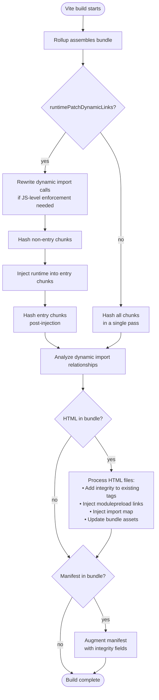

# How the Plugin Works

## The Build Pipeline

The plugin registers as a `post`-order `generateBundle` hook — a single Rollup hook that fires after the full bundle has been assembled and all output files are determined. There is no `transformIndexHtml` hook; both SPA and MPA HTML files are handled the same way, by scanning the in-memory bundle for `.html` assets.

Within `generateBundle`, processing runs in four ordered steps:

**Step 1 — Integrity mappings.** Every `.js`, `.mjs`, and `.css` file in the bundle is hashed using Node's `crypto.createHash`. When `runtimePatchDynamicLinks` is enabled (the default), this runs in two passes: non-entry chunks are hashed first, then the runtime is injected into entry chunks, then entry chunks are hashed — so the entry chunk hash covers the injected runtime code.

**Step 2 — Dynamic import analysis.** The plugin reads Rollup's `chunk.dynamicImports` metadata to build a set of files that are lazily imported. This drives both modulepreload injection and the JS-level import rewriting path.

**Step 3 — HTML processing.** For each `.html` asset in the bundle, the plugin performs three operations in order:

- Adds `integrity` (and optionally `crossorigin`) to existing `<script>`, `<link rel="stylesheet">`, and `<link rel="modulepreload">` tags.
- Injects `<link rel="modulepreload" integrity=...>` for each lazy chunk discovered in step 2 (when `preloadDynamicChunks` is enabled).
- Injects or merges a `<script type="importmap">` carrying an `integrity` object for every emitted JS module.

**Step 4 — Manifest augmentation.** If Vite emitted a build manifest (`build.manifest: true`), the plugin adds `integrity` and `cssIntegrity` fields to each manifest entry. This step runs even when no HTML was emitted, making it the primary path for backend-owned HTML generation.

## What Gets Hashed

Only **JavaScript** (`.js`, `.mjs`) and **CSS** (`.css`) files are hashed. Other asset types — images, fonts, JSON data files — are skipped.

**Local assets** (files emitted by the Rollup build) are read directly from the in-memory bundle. No disk I/O is needed; the bytes in memory are the bytes that will be served.

**Remote assets** (any URL starting with `http://`, `https://`, or `//`) are fetched at build time. Protocol-relative URLs (`//cdn.example.com/lib.js`) are treated as HTTPS. Fetching behavior — caching, deduplication, and timeouts — is configurable; see [Networking](/configure/networking).

Two additional rules apply regardless of asset origin:

- **Existing `integrity` attributes are preserved.** If a tag already carries an `integrity` value, the plugin does not overwrite it.
- **Assets not found in the bundle are skipped.** If a local file reference doesn't resolve to anything in the bundle output, that element is left unchanged (no `integrity` added, no error thrown).

## Why Build Time, Not Runtime

SRI works only when the resource content is known in advance and can be pinned. Vite's production build generates content-addressed filenames like `index-B3sb0LQp.js` — the hash in the filename is derived from the file's content, so it changes with every meaningful source edit. Any integrity value embedded in a template before the build would be wrong by the time the build finishes.

Running at build time, after Rollup has emitted the final assets, means the plugin hashes the exact bytes that will be served and writes those hashes into the HTML before it leaves the build pipeline. The hash-to-filename relationship is stable and the content is locked.

The development server is a different story: HMR rewrites module URLs, injects timestamps, and pushes code changes over WebSocket. Content changes on every edit, stable hashes are impossible, and even if you could hash, coverage would be partial. See [Dev Mode](/troubleshoot/dev-mode) for the full reasoning.
