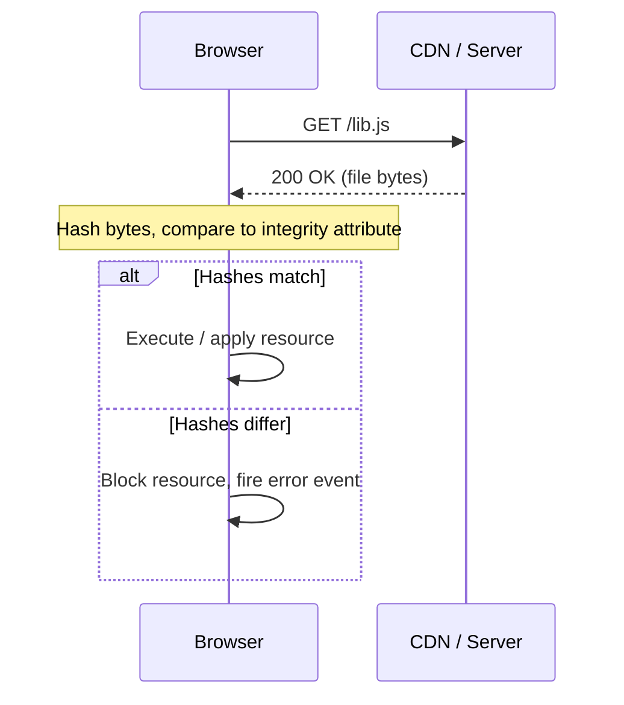

# What is Subresource Integrity?

Subresource Integrity (SRI) is a browser security feature that lets you pin the exact content a `<script>` or `<link>` tag is allowed to load. You do this by adding an `integrity` attribute containing a cryptographic hash of the expected file bytes. If the fetched bytes don't match, the browser refuses to execute or apply the resource.

The [MDN documentation on Subresource Integrity](https://developer.mozilla.org/en-US/docs/Web/Security/Subresource_Integrity) covers the full specification. This page explains the threat model and why automated tooling is necessary.

## The Attack SRI Prevents

A `<script src="...">` tag is an unconditional instruction: the browser fetches whatever bytes are at that URL and executes them with the full privileges of your page. Without SRI, there is no verification step — any bytes, from any source, get executed.

That trust assumption can be broken in several ways:

- **Compromised CDN** — the CDN hosting your dependency is breached, and the attacker replaces a popular library with a version containing malicious code. Every site loading that URL now executes the attacker's code.
- **DNS or routing hijack** — traffic to the CDN is redirected to an attacker-controlled server that serves a tampered file with the same filename.
- **Supply-chain substitution** — a package update, a CI pipeline artifact, or a deploy process is manipulated so that a different file reaches the CDN than the one developers tested.

These are not theoretical: the class of attack became widely discussed after incidents involving widely-used polyfill CDNs where domains changed hands and began serving malicious scripts to millions of sites. SRI prevents execution even when the attacker controls the bytes on the wire — if the hash doesn't match, the browser blocks the resource.

## How Browsers Verify Integrity

The `integrity` attribute contains an algorithm prefix and a base64-encoded hash of the expected file content:

```html
<script
  src="https://cdn.example.com/lib.js"
  integrity="sha384-oqVuAfXRKap7fdgcCY5uykM6+R9GqQ8K/uxy9rx7HNQlGYl1kPzQho1wx4JwY8wC"
  crossorigin="anonymous"
></script>
```

When the browser fetches `lib.js`, it hashes the received bytes with the specified algorithm and compares against the declared value. The check fails closed: if the hashes don't match — or if the `integrity` attribute is present but the browser can't verify (e.g., a CORS error) — the resource is blocked and a network error is surfaced to the page.



## CORS and the `crossorigin` Attribute

For SRI enforcement on cross-origin resources, two things must be in place:

1. **The server must send CORS headers** — specifically `Access-Control-Allow-Origin` covering your page's origin.
2. **The element must carry a `crossorigin` attribute** — this tells the browser to make a CORS request and enables the integrity check.

The two allowed values are:

| Value | Meaning |
| --- | --- |
| `anonymous` | CORS request sent without credentials (cookies, client certificates). Suitable for most public CDN assets. |
| `use-credentials` | CORS request sent with credentials. Required when the server responds differently based on authentication state. |

Omitting `crossorigin` on a cross-origin resource means the browser fetches it without CORS and cannot verify integrity — the check is silently skipped. For same-origin resources (local assets on your own domain), the `crossorigin` attribute is not required for integrity enforcement.

## Choosing an Algorithm

Three algorithms are supported: `sha256`, `sha384`, and `sha512`. All are strong enough for this use case; the differences are in hash length and performance:

| Algorithm | Hash size | Notes |
| --- | --- | --- |
| `sha256` | 256 bits | Shortest hashes; slightly faster to compute |
| `sha384` | 384 bits | **Default for this plugin.** Good balance of size and security margin. |
| `sha512` | 512 bits | Longest hashes; highest security margin |

When multiple `integrity` values are listed for a single resource (space-separated), browsers use the strongest algorithm present. The plugin emits a single algorithm per build, configurable via the [`algorithm` option](/configure/options).

## Where This Plugin Fits

Hand-authoring SRI hashes is practical for stable third-party CDN assets where the URL and content don't change often. It breaks down immediately for the files your own build produces.

Vite generates content-addressed filenames: `index-B3sb0LQp.js`, `chunk-Cab12xJ4.js`. The hash in the filename changes whenever the source changes. If the filename changes, the URL changes, the old integrity value is wrong, and any hand-written hash in your HTML is instantly stale.

The only practical approach is to compute and inject SRI hashes as the last step of the build, after all assets are finalized and their hashes are known. That's exactly what this plugin does — see [How the Plugin Works](./how-it-works).
